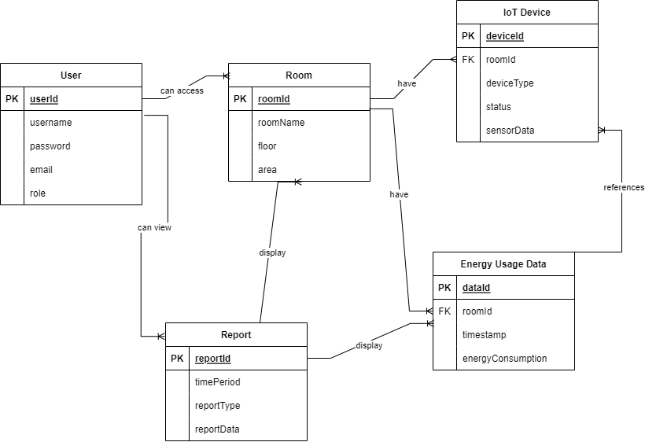

# Kelompok 11 (ProJoy)

| Nama | NIM | Peran |
| ---- | --- | ----- |
| Maulana Anjari Anggorokasih | `21/477748/TK/52619` | Project Manager & Software Engineer (SE) |
| Diestra Pradana Duta Ramadhan | `21/478179/TK/52693` | AI Engineer (AIE) & Cloud Engineer (CE) |
| Raffid Aditya Hermawan | `21/482635/TK/53331` | UI UX Designer (UXD) |

#### Departemen Teknologi Elektro dan Teknologi Informasi, Fakultas Teknik, Universitas Gadjah Mada

# ⚡Energy Wise
### Energy Wise: Manajemen Energi Cerdas pada Bangunan Perkantoran

Pemborosan energi di gedung perkantoran menjadi perhatian utama, karena tidak hanya berdampak pada biaya operasional tetapi juga memberikan kontribusi terhadap dampak lingkungan yang tidak diinginkan. Kondisi suhu dan pencahayaan yang tidak terkendali serta perangkat elektronik yang tidak dimatikan secara efisien dapat menyebabkan pemborosan energi yang signifikan.

### `Bagaimana dapat mengurangi pemborosan energi di gedung perkantoran melalui implementasi teknologi?`

## 💡 Ide Solusi
Aplikasi berbasis web yang bernama Energy Wise untuk manajemen energi cerdas pada bangunan perkantoran.

## 🧩 Rancangan Fitur

| No. | Fitur | Keterangan |
| --- | ----- | ---------- |
|1| Memonitor penggunaan energi di setiap ruangan gedung secara real-time | Menyajikan data suhu, pencahayaan, dan penggunaan energi secara real-time. Grafik dinamis untuk memvisualisasikan perubahan dalam kondisi gedung. |
|2| Laporan kinerja untuk membantu pengelola gedung membuat keputusan yang lebih baik | Menyediakan pengguna laporan yang terperinci tentang konsumsi energi dan operasional gedung. |
|3| Memprediksi konsumsi energi | Memprediksi konsumsi energi berdasarkan history penggunaan dan kondisi gedung (IoT) untuk mengoptimalkan operasi gedung, termasuk pengaturan suhu dan pencahayaan, agar sesuai dengan kebutuhan pengguna dan tujuan efisiensi energi. Adaptasi terhadap perubahan kebutuhan gedung, cuaca, dan kondisi fisik lainnya dengan menyesuaikan pengaturan energi secara prediktif. |
|4| Rekomendasi solusi pemborosan energi | Mengidentifikasi dan mengklasifikasikan pola pemborosan di gedung, serta memberikan rekomendasi penghematan energi, misalnya misalnya dengan mengatur waktu penggunaan perangkat elektronik. Identifikasi dan analisis pola penggunaan perangkat elektronik untuk memberikan saran tentang perangkat mana yang dapat dimatikan atau diatur ulang untuk penghematan energi. |

## 📈 Analisis Kompetitor

1. KOMPETITOR 1
   
   | Keypoint | Value |
   | --- | --- |
   | Nama | Schneider Electric: EcoStruxure Building Operation |
   | Jenis Kompetitor | Direct |
   | Jenis Produk | Platform perangkat lunak |
   | Target Customer | Gedung Enterprise |
   | Kelebihan | Terbuka dan fleksibel. Sistem kendali tunggal. Visibilitas data. Didukung dengan sistem pendukung keputusan berbasis wawasan. |
   | Kekurangan | Kompleksitas implementasi. Biaya yang cukup mahal mengingat ditujukan untuk enterprise building. Gangguan jaringan atau masalah teknis dapat mempengaruhi operasional sistem. |
   | Key Competitive Advantage & Unique Value | Biaya yang relatif lebih murah. Dukungan pelanggan yang lebih baik. Menawarkan tingkat kustomisasi yang lebih tinggi. Kontrol perangkat yang lebih fleksibel. |
2. KOMPETITOR 2
   
   | Keypoint | Value |
   | --- | --- |
   | Nama | Siemens: Desigo CC |
   | Jenis Kompetitor | Direct |
   | Jenis Produk | Platform perangkat lunak |
   | Target Customer | Gedung komersial, industri manufaktur |
   | Kelebihan | Terintegrasi dan terbuka. Skalabilitas. Kontrol total bangunan. Memberikan solusi manajemen bangunan yang terbuka, kuat, dan mengubah kenyamanan, keamanan, dan efisiensi. |
   | Kekurangan | Kompleksitas implementasi. Biaya yang cukup mahal. Gangguan jaringan atau masalah teknis dapat mempengaruhi operasional sistem. |
   | Key Competitive Advantage & Unique Value | Biaya yang relatif lebih murah. Dukungan pelanggan yang lebih baik. Menawarkan tingkat kustomisasi yang lebih tinggi. Kontrol perangkat yang lebih fleksibel. |
3. KOMPETITOR 3
   
   | Keypoint | Value |
   | --- | --- |
   | Nama | Honeywell: Building Management System (BMS) |
   | Jenis Kompetitor | Direct |
   | Jenis Produk | Platform perangkat lunak |
   | Target Customer | Gedung komersial, industri manufaktur |
   | Kelebihan | Kemudahan penggunaan. Kontrol total bangunan. Skalabilitas. Keterbukaan. Optimasi energi. |
   | Kekurangan | Kompleksitas implementasi. Biaya yang cukup mahal. Gangguan jaringan atau masalah teknis dapat mempengaruhi operasional sistem. |
   | Key Competitive Advantage & Unique Value | Biaya yang relatif lebih murah. Dukungan pelanggan yang lebih baik. Menawarkan tingkat kustomisasi yang lebih tinggi. Kontrol perangkat yang lebih fleksibel. |

## Metodologi SDLC yang digunakan: Agile
Alasan memilih SDLC Agile karena lebih fleksibel terhadap perubahan, komunikasi yang lebih terbuka antar anggota tim pengembang, dan memungkinkan produk untuk lebih responsif terhadap perubahan.

## Perancangan Tahap 1-3 SDLC

### Tujuan dari produk
Produk bertujuan untuk membantu perkantoran mengelola penggunaan energi mereka secara lebih efisien dengan memberikan informasi yang akurat tentang konsumsi energi di setiap ruangan gedung, laporan tentang konsumsi energi dan operasional gedung, prediksi konsumsi energi berikutnya, dan rekomendasi solusi pemborosan energi.

### Pengguna potensial dari produk dan kebutuhan para pengguna
Manajer gedung perkantoran atau perusahaan yang ingin mengelola konsumsi energi mereka secara lebih efisien.

### Use Case Diagram

### Functional requirements untuk use case yang telah dirancang

| FR | Deskripsi |
| --- | --- |
| Monitoring konsumsi energi | Sistem dapat memantau penggunaan energi di setiap ruangan gedung secara real-time. Informasi tentang penggunaan energi harus disajikan dengan jelas dan dapat diakses oleh pengguna. |
| Prediksi konsumsi energi | Sistem dapat menganalisis data historis penggunaan energi dan faktor-faktor lainnya untuk memprediksi konsumsi energi di masa depan. Prediksi akurat dan dapat diandalkan untuk membantu manajer gedung atau administrator dalam perencanaan penggunaan energi. |
| Pelaporan tentang konsumsi energi dan operasional gedung | Sistem menyediakan fitur pelaporan yang memungkinkan administrator untuk melihat data penggunaan energi secara historis, tren, operasional gedung, dan informasi lainnya. |
| Rekomendasi solusi pemborosan energi | Sistem dapat memberikan rekomendasi kepada administrator dan pengguna tentang cara mengurangi pemborosan energi berdasarkan analisis data dan pola. |
| Integrasi dengan perangkat IoT | Sistem dapat berkomunikasi dengan perangkat IoT yang terpasang di gedung untuk mengumpulkan data tentang penggunaan energi dan kondisi lingkungan. |
| Notifikasi dan pemberitahuan | Sistem dapat mengirimkan notifikasi atau pemberitahuan kepada pengguna tentang peristiwa penting, seperti perubahan signifikan dalam konsumsi energi atau penggunaan energi telah melewati batas wajar. |
| Manajemen pengguna | Sistem memiliki fungsionalitas untuk mengelola pengguna yang berbeda, seperti administrator atau manajer gedung dan penghuni gedung. |

### Entity Relationship Diagram

### Low-fidelity Wireframe

1. Halaman Dashboard
   
2. Halaman Laporan
   
3. Halaman Monitor IoT
   
4. Halaman Rekomendasi
   
5. Halaman Profil
   

### Gantt-Chart pengerjaan proyek dalam kurun waktu 1 semester
